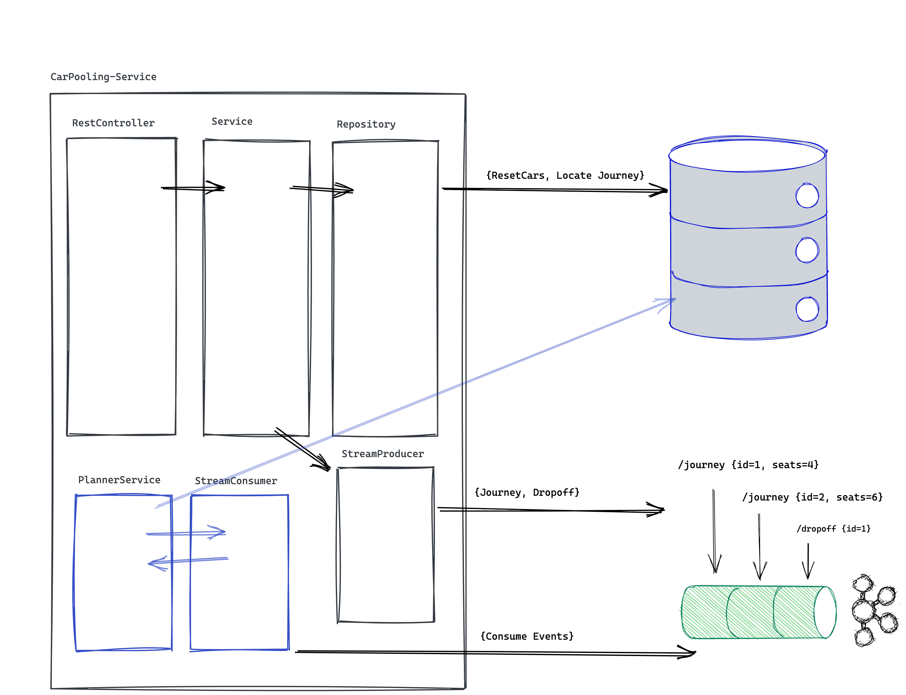

# Car Pooling Service Application

We design and implement a system to manage car pooling.

We intend to provide the service of taking people from point A to point B.
And we want to do so using Car Pooling in order to optimize resources (cars).

We will build the car availability service that will be used to track the 
available seats in cars.

Cars have a different amount of seats available, they can accommodate groups of
up to 4, 5 or 6 people.

People requests cars in groups of 1 to 6. People in the same group want to ride
on the same car. You can take any group at any car that has enough empty seats
for them. If it's not possible to accommodate them, they're willing to wait until 
there's a car available for them. Once a car is available for a group
that is waiting, they should ride. 

Once they get a car assigned, they will journey until the drop off, you cannot
ask them to take another car (i.e. you cannot swap them to another car to
make space for another group).

In terms of fairness of trip order: groups should be served as fast as possible,
but the arrival order should be kept when possible.
If group B arrives later than group A, it can only be served before group A
if no car can serve group A.

For example: a group of 6 is waiting for a car and there are 4 empty seats at
a car for 6; if a group of 2 requests a car you may take them in the car.
This may mean that the group of 6 waits a long time,
possibly until they become frustrated and leave.

## API

To simplify the challenge and remove language restrictions, this service must
provide a REST API which will be used to interact with it.

This API must comply with the following contract:

### GET /status

Indicate the service has started up correctly and is ready to accept requests.

Responses:

* **200 OK** When the service is ready to receive requests.

### PUT /cars

Load the list of available cars in the service and remove all previous data
(existing journeys and cars). This method may be called more than once during 
the life cycle of the service.

**Body** _required_ The list of cars to load.

**Content Type** `application/json`

Sample:

```json
[
  {
    "id": 1,
    "seats": 4
  },
  {
    "id": 2,
    "seats": 6
  }
]
```

Responses:

* **200 OK** When the list is registered correctly.
* **400 Bad Request** When there is a failure in the request format, expected
  headers, or the payload can't be unmarshalled.

### POST /journey

A group of people requests to perform a journey.

**Body** _required_ The group of people that wants to perform the journey

**Content Type** `application/json`

Sample:

```json
{
  "id": 1,
  "people": 4
}
```

Responses:

* **200 OK** or **202 Accepted** When the group is registered correctly
* **400 Bad Request** When there is a failure in the request format or the
  payload can't be unmarshalled.

### POST /dropoff

A group of people requests to be dropped off. Whether they traveled or not.

**Body** _required_ A form with the group ID, such that `ID=X`

**Content Type** `application/x-www-form-urlencoded`

Responses:

* **200 OK** or **204 No Content** When the group is unregistered correctly.
* **404 Not Found** When the group is not to be found.
* **400 Bad Request** When there is a failure in the request format or the
  payload can't be unmarshalled.

### POST /locate

Given a group ID such that `ID=X`, return the car the group is traveling
with, or no car if they are still waiting to be served.

**Body** _required_ A url encoded form with the group ID such that `ID=X`

**Content Type** `application/x-www-form-urlencoded`

**Accept** `application/json`

Responses:

* **200 OK** With the car as the payload when the group is assigned to a car.
* **204 No Content** When the group is waiting to be assigned to a car.
* **404 Not Found** When the group is not to be found.
* **400 Bad Request** When there is a failure in the request format or the
  payload can't be unmarshalled.

## Non-Functional Properties
We would like to manage a state with $`10^5`$ cars, we need a scalable solution. We will focus on providing a
horizontally scalable solution. Which means, if the load increases, we can maintain the response times by increasing the
number of replicas of this system. I provide more details below.

## Application
We focus on (i) the scalability of the system (i.e. what happens if the load suddenly increases from $`10^5`$
to $`10^7`$), and (ii) the extensibility (i.e. what if product asks for more features, how long would it take to be
implemented?)

**System Design exercise**
<br />We can split the API into 2 families:
- Asynchrounous endpoints: `/journey`, `/dropoff`
- Synchronous endpoints: `/status`, `/cars`, `/locate`

We can also think of the main and most resource consuming part of the application is the _Journey Planner_, i.e. the
algorithm that matches journeys to cars. So if we want to make this scalable enough, we should de-couple that part from
the main application.

In the diagram below we see how the blue part is the planner that can even take out into other service/docker image and
run independently.



**Key aspects of the system** <br/>
The system follows a three-tier architecture with Controller, Service and Repository layers. The service, which is the
one holding the _business logic_ can (i) query or persist data into the repository, or (ii) can produce events to a
stream.

The _PlannerService_ works independently and consumes events from the stream, tries to match journeys to cars, and
updates the state in the data store.

**Technologies** <br/>

As of the system, we've chosen Java and Spring Boot.

*Datastore* <br/>
For the datastore, we would chose something that has transactionality (i.e. some support of OLTP and with ACID
properties). In this case we would like to chose Postgres. If in the future the scalability is a problem, I would look
into more cloud-native and scalable solutions like AWS Aurora but still with the same Postgres Engine.

If the datastore is still a bottleneck, we'd move to an eventually consistent system, like Cassandra.

*Streaming* <br/>
The de-facto election here is Kafka, both for the community adoption, managed offering in Cloud systems, and scalability
options.

Kafka allows us to split the streams into partitions, therefore, even if we have billions of journeys we could split
cities into different Kafka Partitions, then giving us the possibility of horizontal growth.

*Scalable planner* <br/>
The planner has multiple workers (threads) which are configurable. This is emulated as a Thread Pool but this shows how
each thread could *potentially* (after revisiting partitions of the stream) be a replica (in the world of Kubernetes).

*Limitations* <br/>
Since we didn't want to use a Database (I could use H2 as an embedded one), nor Kafka, since it makes very difficult to operate with external systems;
we implemented the datastore and
the streams in plain Java. This "home-made" stream consumer uses "polling", which we might think it's not good enough.
We could use an observer pattern here to improve this.

However, we've used Java Interfaces so moving this to a real world scenario is a simple task.

*Distributed system and eventual consistency*<br/>
Since we are using streams, and we decoupled the planner using a thread pool, the system is eventually consistent, and
it might happen that for a time T, a car is available, a journey is waiting, but the planner has not matched the journey
yet. This is the price to pay if we want a horizontally scalable solution (this is the C in the CAP theorem).

**Testing**<br/>
We don't provide any tests, and this is bad. But with enough time provided we'd add mainly component testing at the functional units (i.e. the planner with its integrations).

**Algorithm performance**<br/>
In the [PlannerService](src/main/java/dev/carpooling/planner/PlannerService.java) we have an algorithm with an unacceptable performance (it is O(n^2) in time). We haven't
put much thought on it since it can be improved easily if we use some data store that allows index (thus using btrees as a storage), or materialized views.

**Transactional**<br/>
In the [PlannerService](src/main/java/dev/carpooling/planner/PlannerService.java) we have the annotation `@Transactional` commented since we would need to have a transaction
manager and some kind of transactionality. This comes for free if we use any OLTP, or we could implement it in the application if we use a system like DynamoDB/Cassandra.

Regarding this, there are bidirectional references among `Car <-> Journey` and even though this doesn't seem too sound, they can be removed if we use some proper datastore. 

## How to Run this application
Creating the app:
```bash
mvn clean package
docker build -t car-pooling .
```

Running the app:
```bash
docker run -p 8080:8080 car-pooling:latest
```

Using the API:
```bash
curl --request GET \
  --url http://localhost:8080/status
  
curl --request PUT \
  --url http://localhost:9091/cars \
  --header 'content-type: application/json' \
  --data '[
	{
		"id": 1,
		"seats": 4
	},
	{
		"id": 2,
		"seats": 6
	},
	{
		"id": 3,
		"seats": 5
	}
]'

curl --request POST \
  --url http://localhost:9091/journey \
  --header 'content-type: application/json' \
  --data '{
	"id": 4,
	"people": 4
}'

curl --request POST \
  --url http://localhost:9091/dropoff \
  --header 'Content-Type: application/x-www-form-urlencoded' \
  --data ID=4
  
curl --request POST \
  --url http://localhost:9091/locate \
  --header 'Content-Type: application/x-www-form-urlencoded' \
  --data ID=4
```

